<div align="center">


<br>

[](https://www.linkedin.com/in/abolfazl-ranjbaran-8307b1353/)
[](https://t.me/Abolfazl_rwm)
[](https://patrik-rwm.ir/)
[](mailto:abolfazl.rwm@gmail.com)


</div>

<div align="center">

### THE LAB

*I like difficult problems — not because they're easy to explain, but because they're interesting to solve.*

</div>

<br>

<a href="https://github.com/Abolfazlrwm/SecureSync">
  
</a>

<a href="https://github.com/Abolfazlrwm/Machine-Learning">
  
</a>

<a href="https://github.com/Abolfazlrwm/awesome-telegram-bots">
  
</a>

<div align="center">

</div>

## HOW I BUILD

```text
01  UNDERSTAND   Start with the problem, not the framework.
02  DESIGN       Think about boundaries, trade-offs and failure modes.
03  BUILD        Make it real.
04  BREAK        Test the things that shouldn't fail.
05  DOCUMENT     If a decision matters, write down why.
```

## CURRENTLY BUILDING

```text
◉ Software systems & clean architecture
◉ AI / machine learning projects
◉ Networking & encrypted communication
◉ Developer tools & automation
```

<div align="center">

</div>

## ENGINEERING

<!-- Keep only what you can defend in an interview. -->


## WORK WITH ME

| | |
|---|---|
| **Telegram bots** | Shops, subscriptions, games, moderation, AI assistants — designed, deployed and maintained. |
| **Web applications** | Django / Next.js backends and frontends, from idea to production. |
| **AI integration** | Adding ML and LLM features to existing products. |

Have a project in mind? Message me on [Telegram](https://t.me/Abolfazl_rwm) or [email me](mailto:abolfazl.rwm@gmail.com).

<div align="center">

</div>
